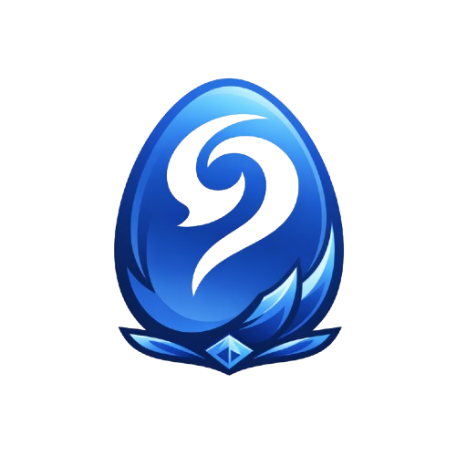

# Dokky

Application de mirroring Android dédiée et optimisée pour Dofus Touch. Gratuit et open source.

<p align="center">
  
</p>

## Fonctionnalités

- **Mirroring USB** : Affichez et contrôlez Dofus Touch directement sur votre PC via USB
- **Multi-instance** : Ouvrez plusieurs instances de Dofus Touch sur un même device Android
- **Interface à onglets** : Naviguez entre vos comptes comme des onglets Chrome
- **Vidéo intégrée** : Rendu H.264 directement dans l'app via WebCodecs (pas de fenêtre scrcpy)
- **Clonage APK** ¹ : Créez des clones de Dofus Touch avec noms et icônes personnalisés
- **Raccourcis clavier** ² : Mappez des touches à des zones de l'écran (sorts, actions) *
- **Presets de performance** : Ultra, High, Medium, Low ou configuration personnalisée
- **Multi-device** : Gérez plusieurs téléphones Android simultanément *

\* *Fonctionnalité Pro*

## Pré-requis

- Un téléphone Android avec **Dofus Touch** installé
- **USB Debugging** activé sur le téléphone ([comment faire](https://developer.android.com/studio/debug/dev-options))
- Un câble USB

## Installation

### macOS

1. Téléchargez le `.dmg` depuis les [Releases](https://github.com/Flosk6/Dokky/releases/latest)
   - **Apple Silicon** (M1/M2/M3/M4) : `Dokky_x.x.x_aarch64.dmg`
   - **Intel** : `Dokky_x.x.x_x64.dmg`
2. Ouvrez le `.dmg` et glissez Dokky dans `/Applications`
3. Au premier lancement : clic droit > Ouvrir (pour contourner Gatekeeper)

### Windows

1. Téléchargez l'installeur depuis les [Releases](https://github.com/Flosk6/Dokky/releases/latest)
   - `Dokky_x.x.x_x64-setup.exe` (recommandé)
   - ou `Dokky_x.x.x_x64_en-US.msi`
2. Lancez l'installeur

## Utilisation

1. **Branchez** votre téléphone Android en USB
2. **Acceptez** le popup "Autoriser le débogage USB" sur le téléphone
3. Votre device apparaît dans Dokky
4. Cliquez **Nouvelle instance** (ou `Ctrl+T`)
5. Sélectionnez le compte Dofus Touch à lancer
6. Jouez !

### Raccourcis de navigation

| Raccourci | Action |
|-----------|--------|
| `Ctrl+T` | Nouvelle instance |
| `Ctrl+W` | Fermer l'instance active |
| `Ctrl+1-9` | Aller à l'onglet N |
| `Ctrl+Tab` | Onglet suivant |
| `Ctrl+Shift+Tab` | Onglet précédent |

### Clonage de comptes ¹

Pour jouer plusieurs comptes, vous devez créer des **clones** de Dofus Touch :

1. Ouvrez le panneau **Devices** (icône téléphone dans la sidebar)
2. Cliquez **+ Nouveau clone APK**
3. Donnez un nom (ex: "Féca PvP") et une couleur
4. Attendez le clonage (~30 secondes)
5. Le clone apparaît dans la liste et peut être lancé comme une instance séparée

### Raccourcis en jeu ² (Pro)

1. Cliquez sur l'icône **touche clavier** dans la sidebar
2. Cliquez sur une zone vide ou dessinez une zone sur l'écran
3. Assignez une touche et un label
4. En jeu, appuyez sur la touche pour simuler un tap dans la zone
5. Maintenez la touche pour un appui long

## Performance

Ouvrez le panneau **Performance** (icône sliders) pour ajuster :

- **Presets** : Ultra (4K/60fps), High (1080p/60fps), Medium (720p/45fps), Low (540p/30fps)
- **Custom** : résolution, DPI, FPS, bitrate, i-frame interval
- **Optimisations device** : désactiver les animations Android, luminosité minimale

> **Conseil** : Pour 3+ instances, utilisez le preset Medium ou Low. 30 FPS suffit largement pour Dofus Touch.

## Licence Pro

Dokky est gratuit pour le mirroring multi-instance sur un seul device. La licence Pro débloque :

- Multi-device (plusieurs téléphones)
- Raccourcis clavier ²

Prix : 1,99€/mois ou 19,99€/an

## Développement

```bash
# Pré-requis : Node.js 22+, Rust 1.77+, JDK 21 (pour jlink)
# macOS : Homebrew (scrcpy, apktool), Android SDK via Studio
# Windows : Git Bash + Android SDK via Studio (pour apksigner/zipalign)

# Installer les dépendances
npm install

# Collecter les deps externes (adb, scrcpy-server, apktool, JRE minimal)
# Auto-détecte macOS / Windows (Git Bash). Downloads sur Windows, Homebrew sur macOS.
bash scripts/collect-deps.sh

# Lancer en mode dev
cargo tauri dev

# Build production
cargo tauri build
```

Les logs runtime sont écrits sur fichier :
- macOS : `~/Library/Logs/com.dokky.app/dokky.log`
- Windows : `%LOCALAPPDATA%\com.dokky.app\logs\dokky.log`

## Stack

- **Backend** : Tauri v2 + Rust
- **Frontend** : Vue 3 + TypeScript + Vite
- **Vidéo** : WebCodecs (H.264) avec transfert binaire direct
- **Protocole** : Communication directe avec scrcpy-server (pas de CLI scrcpy)

## Limitations connues

- `--new-display` n'est pas stable sur tous les devices/ROMs Android
- La saisie de texte dans le jeu (chat) est bufférisée sur les virtual displays Android — le texte apparaît au refocus du champ. C'est une limitation Android, pas un bug Dokky.
- Les performances dépendent du CPU/GPU du téléphone, de la bande passante USB, et du nombre d'instances

## Avertissements

¹ Le clonage d'application est toléré par Ankama mais n'est pas officiellement supporté. Dokky n'est pas affilié à Ankama.

² L'utilisation de raccourcis clavier ou macros est contraire aux CGU d'Ankama. Dokky n'est en aucun cas responsable des sanctions pouvant en découler. Utilisation à vos risques.

## Licence

Ce projet est source-available sous [Business Source License 1.1](LICENSE).
